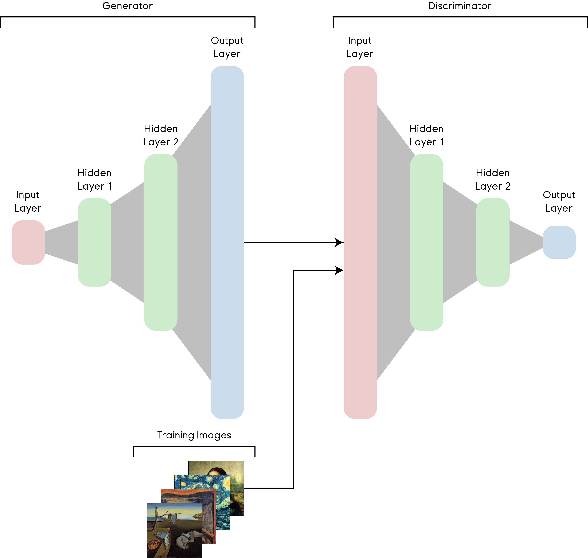
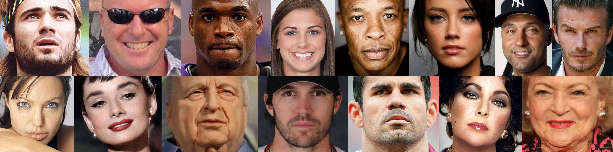
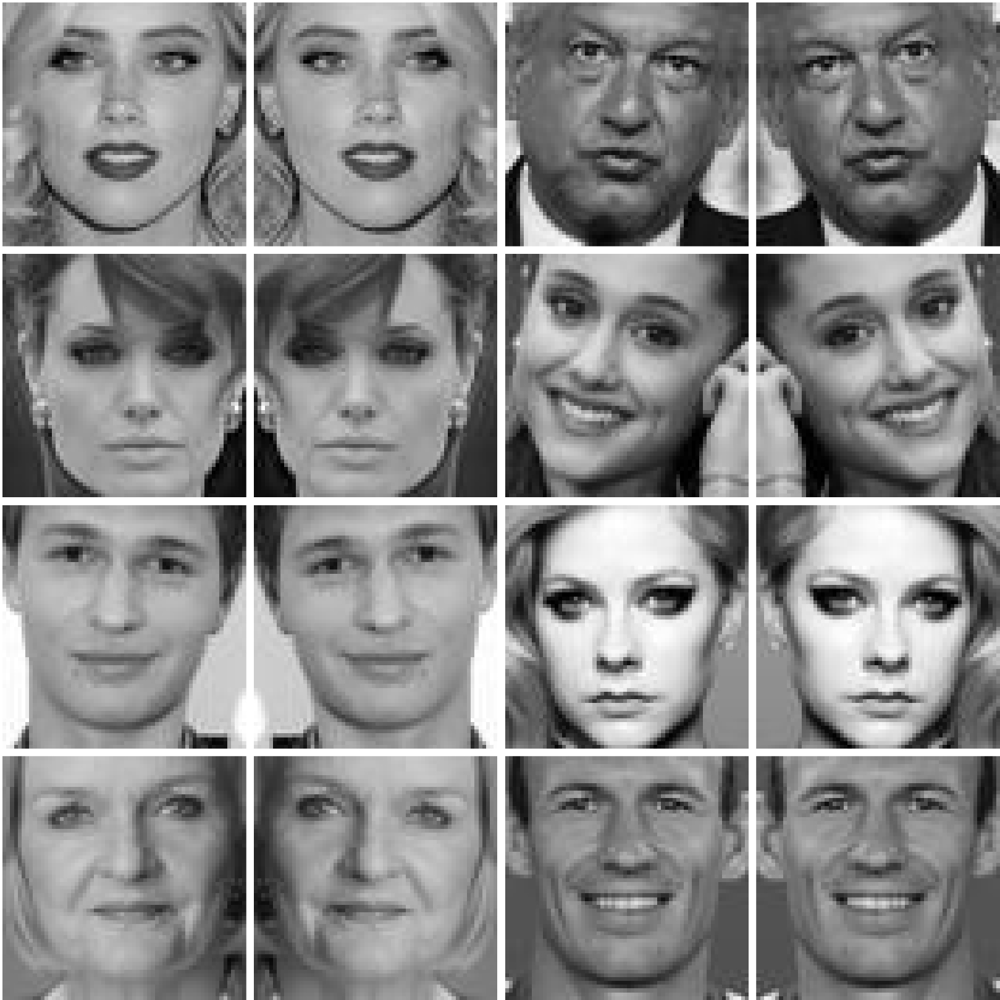
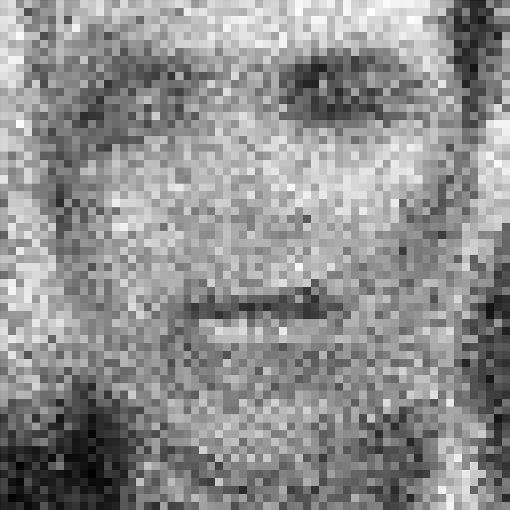
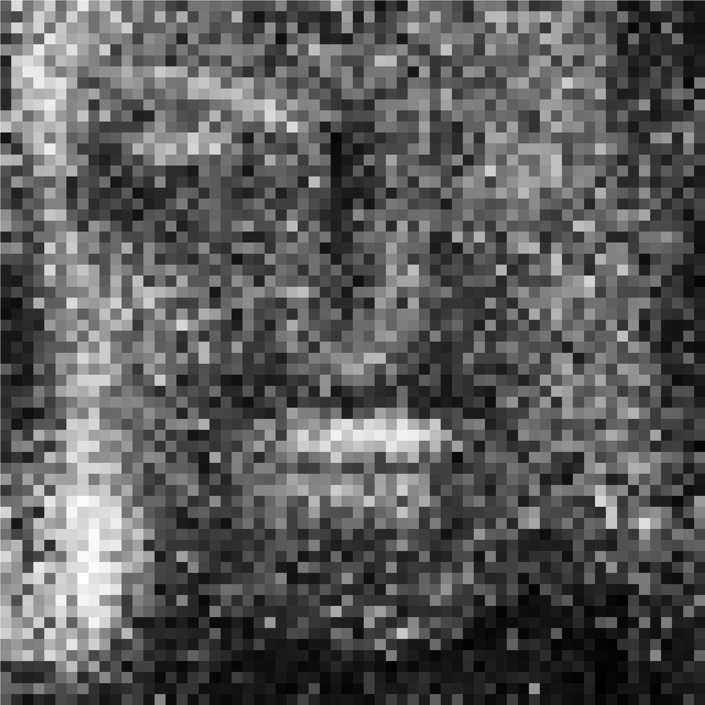
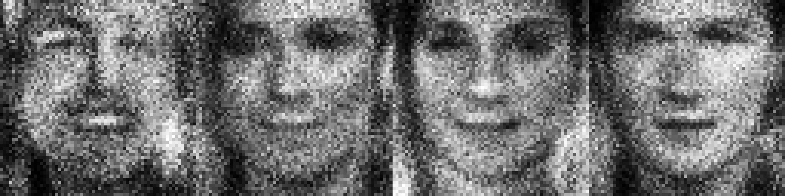
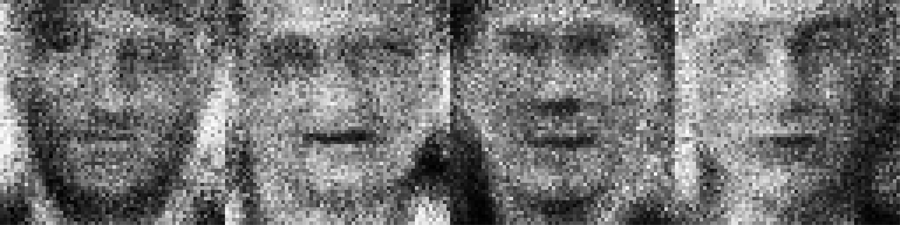
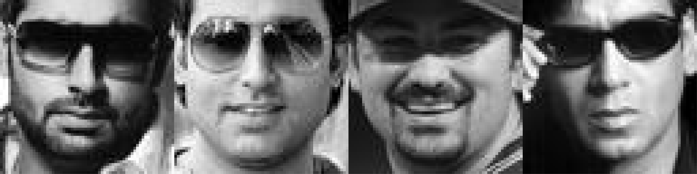

# Generating Artificial Human Faces

In this project, we will use Tensorflow to train a Generative Adversarial Network to generate images of human faces.

## What is a Generative Adversarial Network (GAN)?

Generative adversarial networks (GANs) is an architecture invented by a researcher named Ian Goodfellow in 2014. Here's how it works:

  

We have two neural networks, the generator, and the discriminator.

The generator takes an input of random values (noise) and outputs an image. The discriminator takes an input of an image, which could be real or generated, and outputs a single value on how much it believes the image is real. For instance, we input an image from the training set into the discriminator network and it should output value of 1.0 because the input was a real image.

The training of the discriminator is simple, when we give it a real image, we backpropagate it so the output is 1.0. With a generated image, we do the same but for 0.0.

To train the generator, we feed it an input of random values and generate an image. We then send the image into the discriminator to see what it outputs. Finally, we adjust the weights and biases in the generator so that it can "fool" the discriminator.

Training both the networks is a matter of alternating between feeding the discriminator a real and generated image. This is similar to the idea of a counterfeiter and the police. The generator is the counterfeiter and the discriminator is the police. A counterfeiter produces fake money to fool the police, the police gets better at detecting whether the money is real or fake. Then consequently, the counterfeiter must get better at producing money that can fool the police. This game between the two networks forces each other to get better.

## Preparing the Dataset

For training a network like this, we need a LOT of data. Luckily, taking images of people are quite common. I found a dataset called the [Celebrities in Frontal-Profile (CFP) Dataset](http://www.cfpw.io/) provided by the good people from the University of Maryland and The state University of New Jersey. It comes with 10 frontal and 4 profile images of 500 celebrities. We will use only the frontal images so in total, that's 5,000 images we can use for the training data:

  

To prepare the dataset, I wrote a Python script to walk through the folders containing the images, convert them in 64 x 64 pixel greyscale images and save them into a new folder. In addition, we can double the amount of training data by reflecting each of the images left-to-right as human faces are symmetrical. This is a process called data augmentation. This process was done using a simple image manipulation library I wrote using Python [Pillow](https://pillow.readthedocs.io/en/stable/). So now we have 10,000 greyscale images of faces we can use for the training data:

  

## Training and Final Results

Now we can use Tensorflow to create a GAN model and train it using the dataset. This process took some time as the number of epochs greatly affected the quality. Too little epochs and we just have a noisy image. Too many epochs and the model overfits and only creates a single image no matter the input. After some trial and error, it seems 50 epochs produced good results. Here they are:

  

I was ecstatic. The network was working. Yes, I would agree that some look like Voldemort.

  

Yes, I would agree that some would haunt me in my dreams.

  

And of course they are very noisy, but the network was generating actual recognisable faces.

## Interesting Observations

I would like to note a couple of interesting things from the generated images. The first is that many of them seem
to have white moustaches:

  

I believe this is the result of the network struggling to discern between people smiling with their teeth and having their mouth closed. Another is that the network seemed to be struggling around the eye region:

  

This most probably because the training images contained many images such as these:

  

The fact that most of the images with less recognisable eyes tended to be males, may be because males tend to wear sunglasses more often than females. It is intriguing that the network seemed to create images of both males and females even though it has no concept of gender.

No end this off, I will leave you with the more attractive members of the GAN community.

  

## References

S. Sengupta, J.C. Cheng, C.D. Castillo, V.M. Patel, R. Chellappa, D.W. Jacobs, Frontal to Profile Face Verification in the Wild, IEEE Conference on Applications of Computer Vision, 2016.
